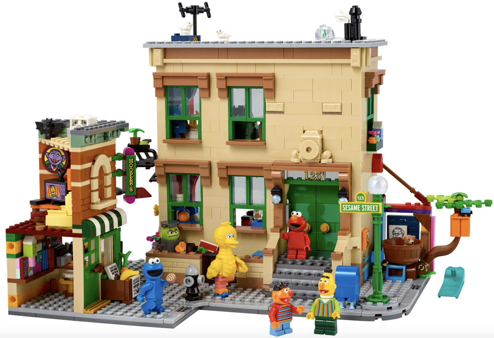
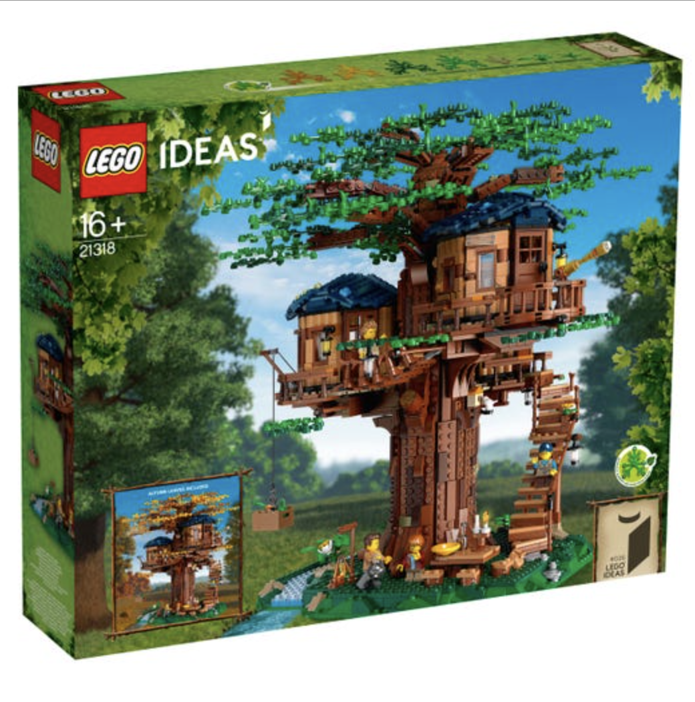
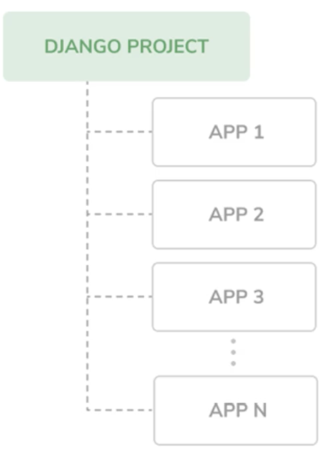

## What is Django?

- Django is a Python framework that makes it easier to create web sites using Python.
- Some well known sites that use Django:
  - Instagram
  - Washington Times
  - Spotify
  - Pintrest

> Show Spotify

#### Static sites vs. web apps

Advantages of web apps:

- functional websites (interactive)
- connect to a database to retrieve dynamic data, tailor to user experience
- save data for next session

#### Django APP vs PROJECT vs FRAMEWORK

1. App
   - An application that performs a specific functionality. E.g. volume control, playlist, sidebar, etc.

2. Project
   - A collection of configurations and apps that when combined together make up a whole application

3. Framework
   - A tool that provides ready-made components or solutions that are customized in order to speed up development

#### Basic commands to remember

1. `ls` - lists out the contents in a directory

   > ls

2. `cd` - change directory of the command line path

   > cd `path/to/directory`

3. `mkdir` - make a directory/folder
   > mkdir `pathname/of/new/directory/`

Why is terminal important?

- allows developers to communicate directly to the computer
- powerful tool to execute commands and run scripts

#### Making our project directory

> mkdir `my_django_website`

#### Virtual Environment

What is a Virtual Environment?

- an isolated environment where we can install and separate our package & library dependencies in our projects
- can also send our app / project to other computers / users and simplifies the process of sharing (don't need to care about versions)

#### Setting up our Venv

> python -m venv <name>
> E.g. `python -m venv env`

- creates virtual environment INSIDE your project folder

> source env/bin/activate

- activate virtual environment

#### Install Django

> pip3 install django

- installs Django

> python3 -m django --version

- check version to make sure we have installed django correctly

#### Starting our Django project

> django-admin startproject <name_of_project>
> E.g. `django-admin startproject first_project`

- creates a new project

#### Working with our project

Open Visual Studio Code!

Test if our project works!

> python3 manage.py runserver

- starts server

> python3 manage.py startapp <name_of_project>
> E.g. `python3 manage.py startapp first_app`

- creates a new app
